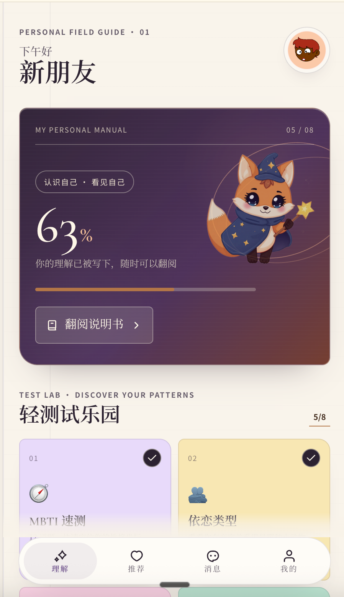
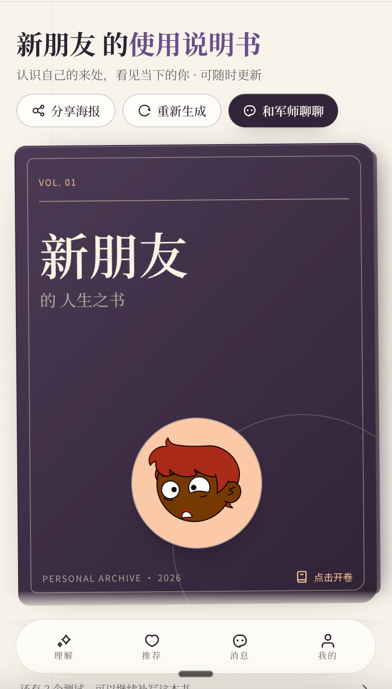
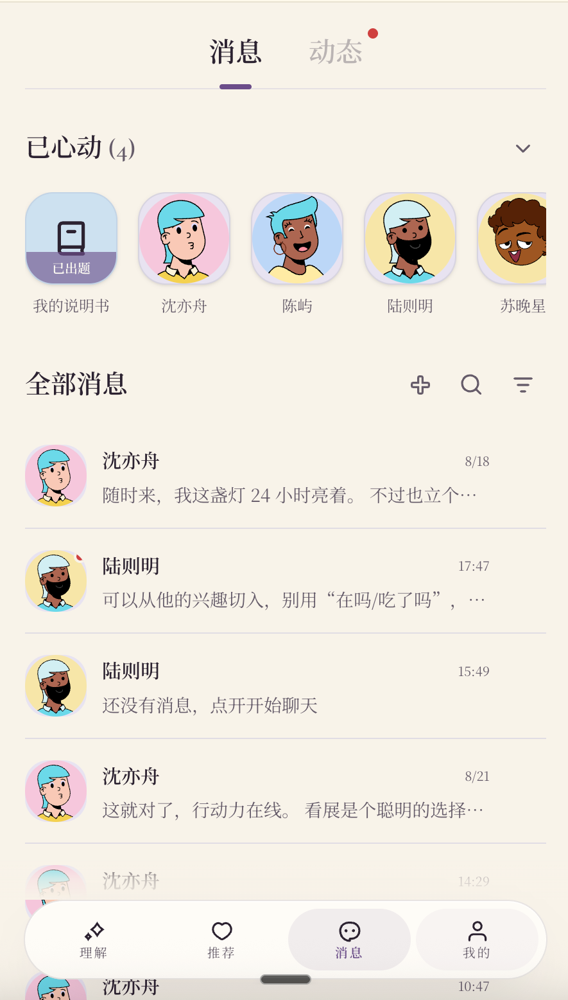
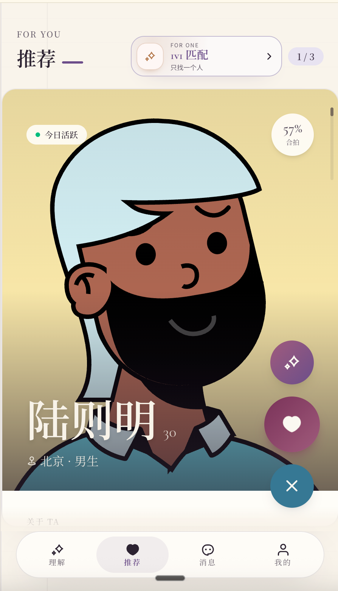
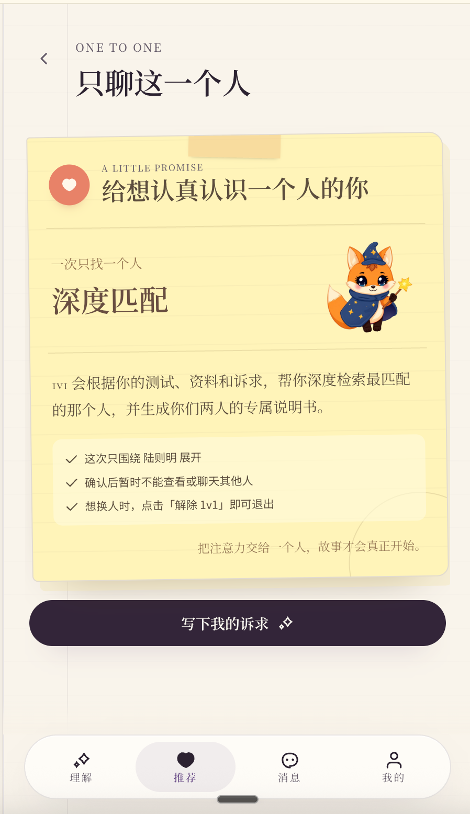
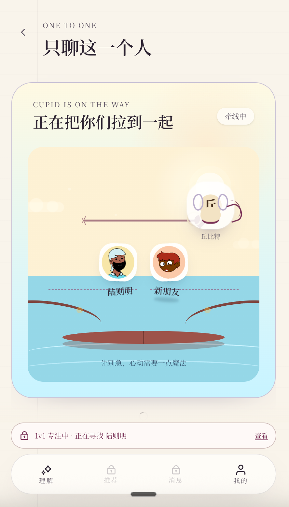

# 见己 · Relationship OS

> 先认识自己，再遇见同频的人。

见己是一款面向认真关系的移动产品：用轻测试整理关系信号，用匹配推荐找到更接近的人，用 1v1 和 AI 军师陪伴关系自然发生。

## 产品定位

| 模块 | 解决的问题 |
| --- | --- |
| 个人说明书 | 把性格、需求、沟通方式整理成可阅读的关系画像 |
| 关系测试 | 用低压力的短测试持续理解自己 |
| 深度匹配 | 基于测试、资料和关系目标寻找更适合的人 |
| 1v1 匹配 | 一次只专注一个人，减少选择疲劳 |
| AI 军师 | 提供回复建议、关系判断和见面方案 |

## 展示页

完整产品展示页已上传至仓库：[打开静态展示页](./public/showcase/index.html)

展示页包含：产品主视觉、Soft Collage 拼贴、Case Study 案例页、Feature Map 功能矩阵。

## 产品截图

### 首页与说明书

<p align="center">
  
  
  
</p>

### 推荐与 1v1

<p align="center">
  
  
  
</p>

## 本地开发

需要 Node.js 20+ 与 npm。

```sh
git clone https://github.com/Debra2559/jianji-relationship-os.git
cd jianji-relationship-os
npm install
npm run dev
```

## 技术栈

- TanStack Start
- TypeScript
- React
- Tailwind CSS
- Supabase
- AI SDK

## 目录

```text
src/                    产品应用
public/showcase/        产品截图与静态展示页
supabase/               数据库迁移与配置
```
